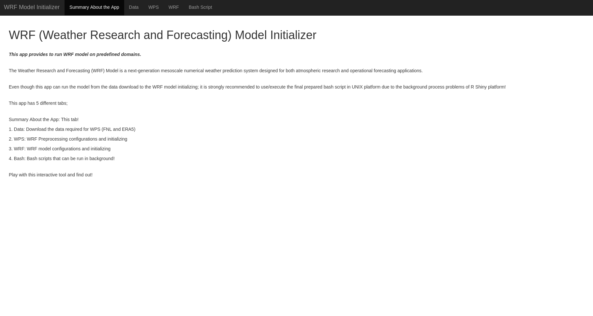
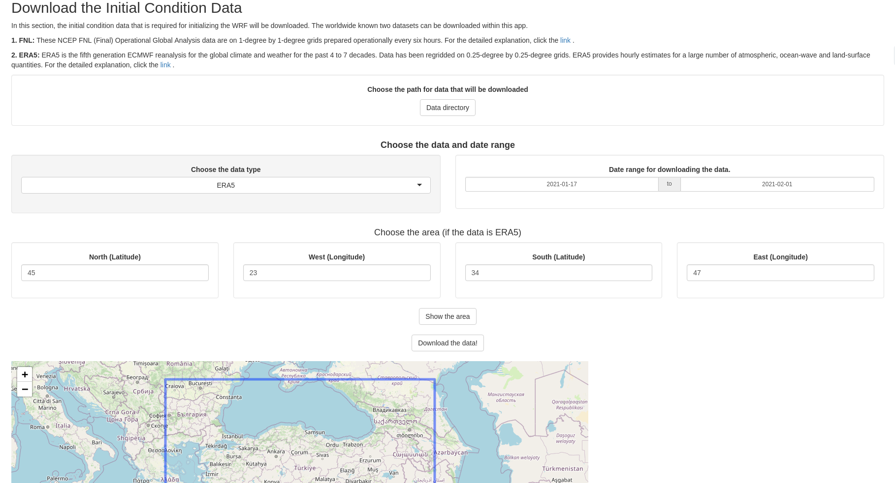
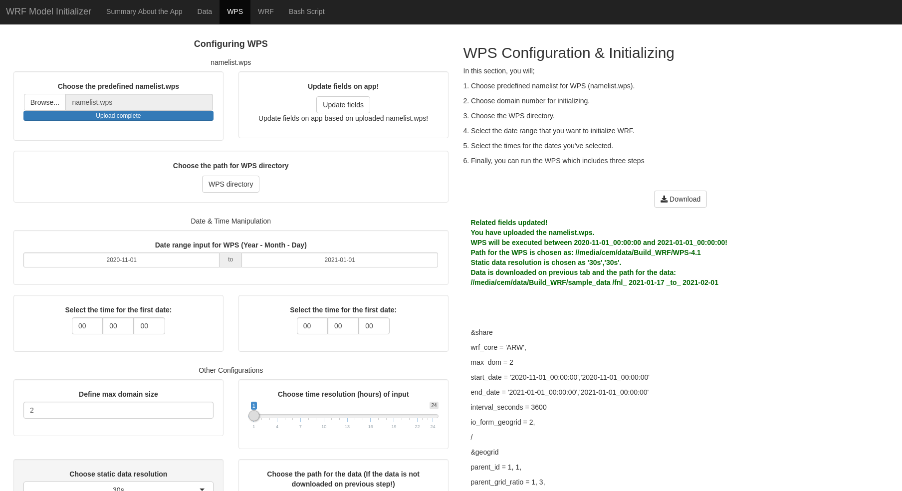
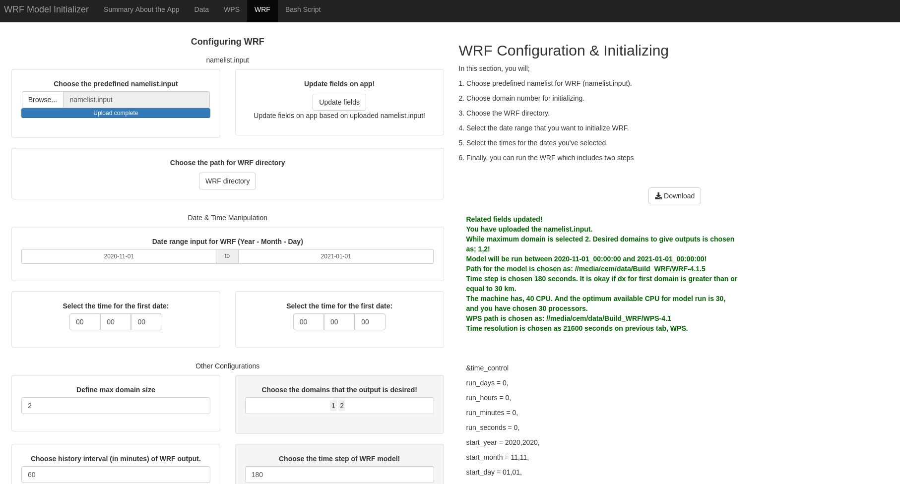
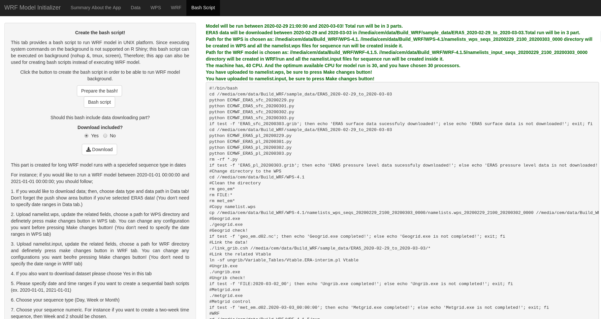

# WRF-ARW Model Initializer with R-Shiny

This repository introduces a WRF-ARW model initializer created with R Shiny. While the app can download FNL or ERA5 data, it can also execute WPS and WRF respectively. Since, model runs could last for several days up to the weeks, the app has also bash script creator tab! Hence; the app can also be used for only configuring the required field and then creating a bash script that includes these changes.

App is created on Ubuntu OS. Due to having some system commands inside the code, it won't be run on Mac and Windows operating systems.

It has five different tabs and each one is explained below.

## 1. Summary About the App
This section introduces the app and the tabs.

## 2. Data
FNL or ERA5 data can be downloaded manually in this tab. Minimum period for data downloading is set as one day. Please make sure to register to the [RDA] website and type your email and passwords in app.R to be able to download FNL. Besides, please follow the instructions found at the [Copernicus] before using the app to download ERA5 data!

[RDA]: https://rda.ucar.edu
[Copernicus]: https://cds.climate.copernicus.eu/api-how-to

Features of the tab;

* Choose the data type
* Define the date ranges
* Choose the area subset if ERA5 is chosen
* ***Show the area*** button for ERA5 data subsets (Mandatory even for global data)

## 3. WPS
This tab is created for configuring the preprocessing part of WRF model which is called WPS. Basically, after uploading the namelist.wps within the app, ***Update parameters*** button can be pushed to update the fields like maximum domain size, static data resolution, date ranges. Then the path for WPS directory should be chosen. Next, ***Check errors*** button should be pushed to see the any errors highlighted in red before proceeding the ***Make the changes!*** button. If it's desired, the parameters which can be seen below could be changed then the ***Make the changes!*** Button can be pressed. This returns the namelist.wps to the panel. You can check whether it's okay or not. Finally, you can execute, georgid, ungrib, and, metgrid respectively or all in one with the WPS initializer button. A condition message about success or failure will be printed to the panel after the executions. Features of the tab;

* Upload the namelist.wps
* Update the parameters of namelist.wps within the app based on the parameters on the uploaded one.
* Choose the path of the WPS directory
* Define the date and time ranges
* Choose the maximum domain size
* Choose the time resolution for the input data (in hours) (For example, while it will be 6 hours for FNL, it is 1 hour for ERA5)
* Choose static data resolution (default, 30s or 10m)
* Choose the path for the input data (if it is not download on previous step!)
* Check errors (It is required before proceeding with ***Make the changes!*** button)
* geogrid.exe, ungrib.exe, metgrid.exe and 3 in 1 buttons to initialize the WPS.

## 4. WRF
This tab provides to make some configurations on WRF/ARW models namelist.input file. The layout is similar to the WPS tabs'. Additionally, domains which are desired to give output, the history interval of the outputs and time step of the model can also be selected in this tab. While ***Check errors!*** and ***Make the changes!*** buttons works same with the ones in WPS tab; there are also options to select whether the WRF model is built with MPI support and CPU core. Features of the tab;

* Upload the namelist.input
* Upload the parameters of namelist.input within the app based on the parameters on the uploaded one.
* Choose the path of the WRF directory
* Define the date and time ranges
* Choose the maximum domain size
* Choose the domains that the output are desired! (It won't let you choose the domains that are greater than max domain size)
* Choose the history interval of the outputs (60 means outputs with 1 hour time resolution)
* Choose the time step (It is recommended to use 6dx)
* Check errors (It is required before proceeding with ***Make the changes!*** button)
* Whether WRF installed with MPI support or not
* Define CPU core number (Automatically detects optimum number of CPU cores to run model with mpi in Linux OS)
* real.exe, wrf.exe and 2 in 1 buttons to initialize the WRF.

## 5. Bash Script
This tab creates a bash script to run WRF model in Linux OS. Since executing system commands on the background is not supported on R Shiny; this bash script can be executed on background (nohup &, tmux, screen), Therefore; this app can also be used for creating bash scripts instead of executing WRF model within. Data downloading part can also be added to the bash script if it's desired and Yes is selected under the options of Download included? question.

This tab also has a part for long WRF model runs with a specified sequence type in dates. It separates data downloading part and namelists (wps and input) based on the specified sequence type (1 month, 2 weeks, 5 days...), sorts and combines them in one bash script. This created bash script can be downloaded and would be run on terminal by typing;

bash bash_sequence_wrf_startdate_enddate.bash

Features of the tab are separated into two, bash script for one time and bash script for multiple times.

* After configuring all the required parameters in the previous tabs (see ***Check errors!*** buttons of previous tabs), ***Prepare the bash!*** button can be used to prepare the bash script inside. 
* ***Bash script*** button can be used to show the created bash after ***Prepare the bash!*** button.
* Should data downloading part be included on bash script

In order to be able to create a bash script for the specified date-time ranges with sequence (bash script for multiple times), following steps should be followed! By the way; a ***Check errors!*** button is also added for this part. It will help you to not forget to set any parameter before proceeding with ***Prepare the bash with sequence!*** button. After observing all the indicators are green after pushing ***Check error!*** button; then it is okay to prepare the bash script with sequence. 
 
* If you would like to download data; then, choose data type and data path in Data tab! Don't forget the push ***Show the area*** button if you've selected ERA5 data! (You don't need to specify date ranges in Data tab.)

* Upload namelist.wps, update the related fields, choose a path for WPS directory and definetely press ***Make the changes!*** button in WPS tab. You can change any configuration you want before pressing ***Make the changes!*** button! (You don't need to specify the date ranges in WPS tab)

* Upload namelist.input, update the related fields, choose a path for WRF directory and definetely press ***Make the changes!*** button in WRF tab. You can change any configurations you want beofre pressing ***Make the changes!*** button! (You don't need to specify the date range in WRF tab)

* If you also want to download dataset please choose Yes in this tab

* Please specify date and time ranges if you want to create a sequential bash scripts (ex. 2020-01-01, 2021-01-01)

* Choose your sequence type (Day, Week or Month)

* Choose your sequence numeric. For instance if you want to create a two-week time sequence, then Week and 2 should be chosen.

* Choose a spin-up time specified in hours (if you do not want any spin-up then you can choose 0)

